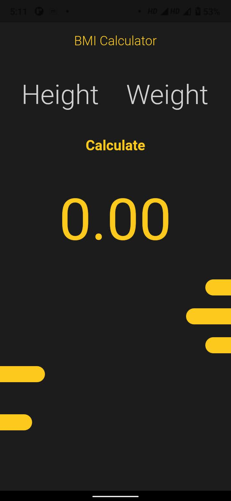

# BMI

This Flutter App helps calculate the BMI of an individual

## Installing

Clone This repository,

`git clone https://github.com/Anonymous7code/BMI-Calculator-Flutter-App-.git`

**NOTE**
Make sure you have installed Flutter on your machine

Run the app,

`flutter run `

## Snapshots

